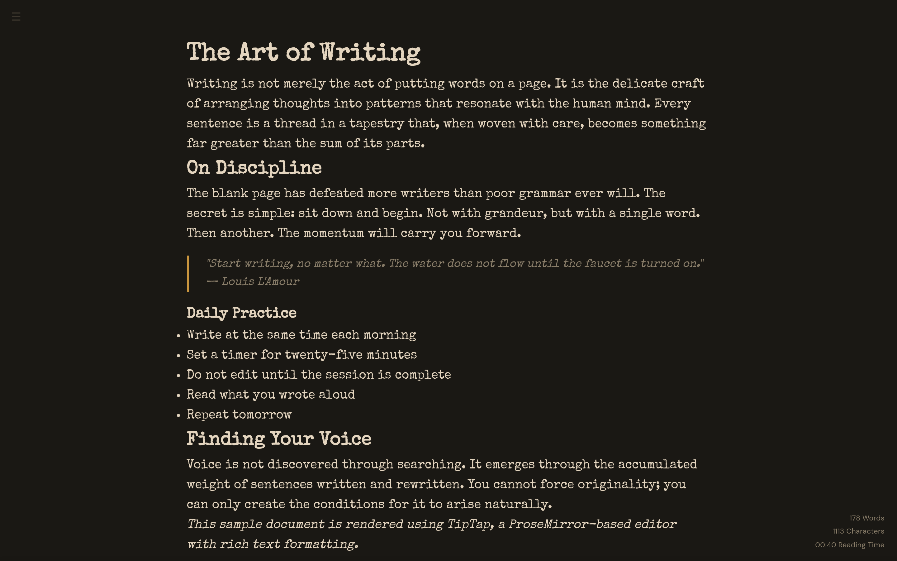
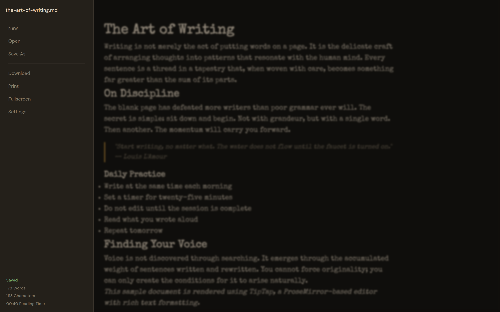
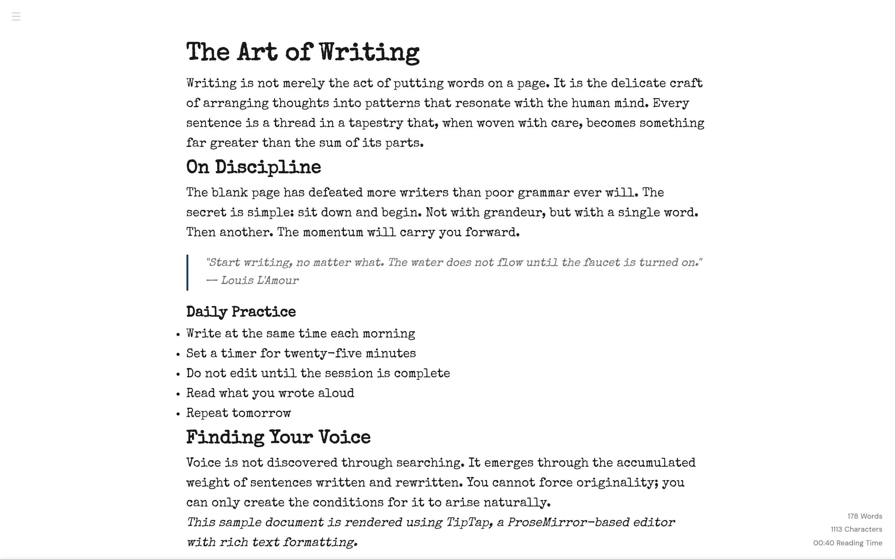
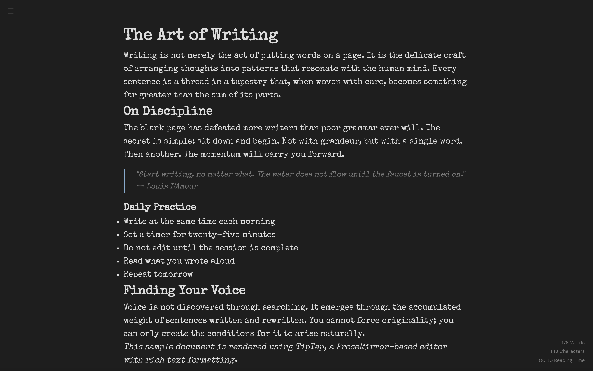
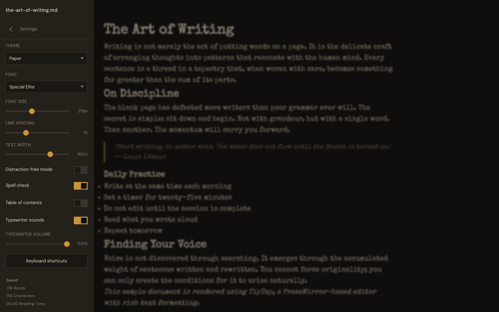

# Scriptorium



A self-hosted writing app. Saves as plain `.md` files. No database,
no accounts, no telemetry.

Started off as a [CalmlyWriter.com](https://calmlywriter.com/) clone, but has outgrown that scope and become its own thing now.

### What it does

- A clean editor with themes (Writer's Study, Mist, Dark, Black,
  Sepia, Paper)
- Fonts, spacing, colors you can tweak
- Auto saves every few seconds
- Focus mode dims everything except your current paragraph
- Keyboard shortcuts for everything (hit `?` to see them)

### What it doesn't do

- No lock-in. Your files are plain Markdown, readable from any editor.
- No database. Just a folder of `.md` files on disk.

---

<details>
<summary>More screenshots</summary>

<br>






</details>

---

### Get started

```bash
git clone <repo>
cd scriptorium
npm install
npm start
```

Open [http://localhost:3000](http://localhost:3000)

Or with Docker:

```yaml
services:
  scriptorium:
    build: .
    ports:
      - "3000:3000"
    volumes:
      - ./data:/app/data
```

---

### Backups

See [RCLONE_SETUP.md](./RCLONE_SETUP.md) for automated backups to any
cloud provider.
